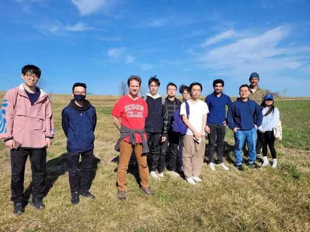

# COMP290-02: Large-scale and Open Source Software Development, spring 2023

* [Syllabus](syllabus-1-24-2023.docx)
* [Overview Schedule](schedule-3-27-2023.xlsx)  <!-- &nbsp;&nbsp;&nbsp;UPDATED on 3/27/2023  -->
* [Detailed schedule](resources)
* [Homework assignments](hw) &nbsp;&nbsp;&nbsp;UPDATED on 4/29/2023 
<!-- * [Instructor's office -->
<!--   hours](https://users.dickinson.edu/~jmac/office-hours.html) -->
<!-- * [CS help room](help-room.md) -->
* [Moodle site](https://lms.dickinson.edu/course/view.php?id=49702)
<!-- * [Zoom -->
<!--   details](https://lms.dickinson.edu/mod/page/view.php?id=1068256) for -->
<!--   occasions when class is online -->
<!-- * [Recordings of some -->
<!--   classes](https://lms.dickinson.edu/mod/page/view.php?id=1068255) -->
<!-- * [FarmData2 GitHub -->
<!--   Repository](https://github.com/DickinsonCollege/FarmData2) -->
* [QRA](qra.md)
* [FarmData2 Zulip Chat](https://farmdata2.zulipchat.com)
* [Epic project team details](epic-team-details.md)
<!-- * [Acknowledgment](acknowledgment.md) -->

----
Last modified: Sat Apr 29 13:20:58 UTC 2023 by jmac.
